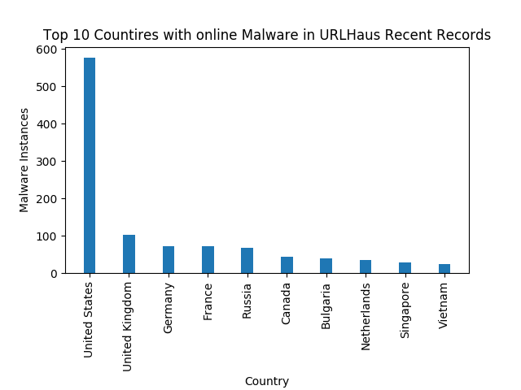

Scripts
======
Random bunch of scripts - Some are really old and may not work out the box anymore - refactoring as and when time permits. 

#### cAudit
script that takes a bunch of routers and login details and pulls IPSec details. While 3rd party assessments and change control cover the establishment of IPsec connections, rolling companies off projects is often less regimented, so its good to get an overview of what stale VPN config might exists.

#### unify_numbers
Scans a CIDR range looking for Siemens / Unify Openstage IP phones via their web interface and prints out the phone number and model if it find a phone

#### urlhaus
hacked together quickly to generate top 10 countries graph from URLhaus Malware recent additions. Requires an IPINFO.io api Key

#### k8s_install_master.sh
Script to install master node of a single node k8s cluster

#### k8s_install_worker.sh
script to install a worker node for a single node k8s cluster
